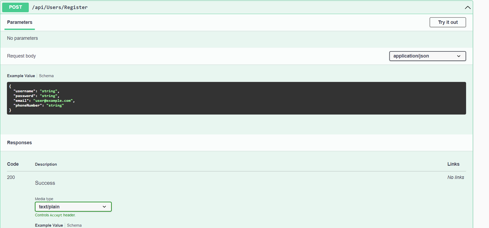

# Async-Inn-Management-System# Async-Inn
- Async-Inn project
- made by yousef samara
- Apr 28th 2022

This app maids for a hotel management system. Users can view the hotels, rooms, and the amenities that available.

# explination:

i have made three models Hotels, Rooms, and Amenities and every model have three interfaces and there are service for each of the controllers.

### using three rauts i can see the data in datapase taples:

api/Amenities
api/Hotels
api/Rooms
........................................................................................................
## LAB 13 Dependency Injection

1. i Build three interface one for each of the Hotels, Rooms, and Amenities controllers  that contain the required method signatures to all for CRUD operations to the database in side the models folder,

2. then i make a service for each of Hotels, Rooms, and Amenities controllers that have the interface actions like ubdate and delete ang crete and get

3. then i Updated the Controller to use the appropriate method from the interface rather than the DBContext directly to make less woke for the Controller.

## LAB 14 Navigation Properties & Routing

i did Createed an interface and service for HotelRoom and add ability to add and remove amenities to a specific room, and i did add a navigation properties and Modify the routes some controller.
........................................................................................................

## Lab: 16 - DTOs & Testing

at this lab i did add 'DTO' for Amenities, Rooms, HotelRooms, and Hotels to control the return data and have more security and that by adding a DTO folder and change the servesis and Dbcontixt and the interfaces
........................................................................................................

## Lab: Identity
at this lab i added the Register and signin for the user and add the swagger.
........................................................................................................

## tests 

i did aded six test using Mock 

# API Routes

## Register

## Login

## Users

## Hotels

## Rooms

## Amenities

## HotelRooms

## RoomAmenities

